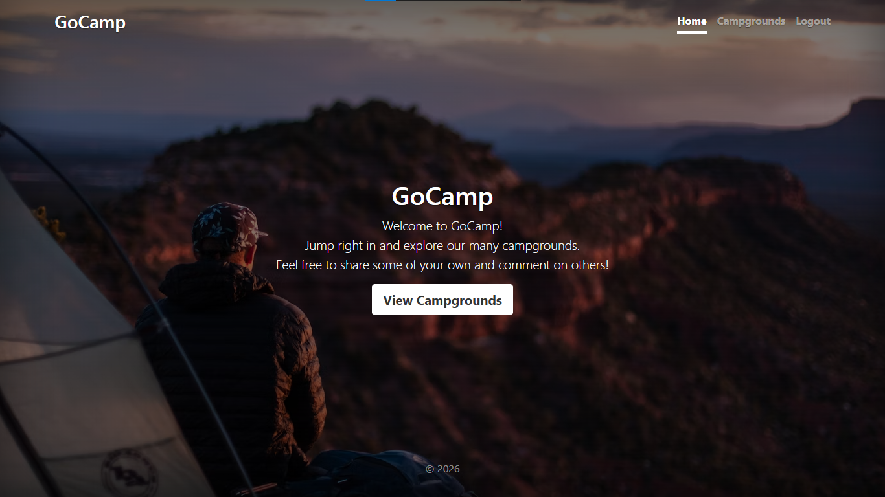
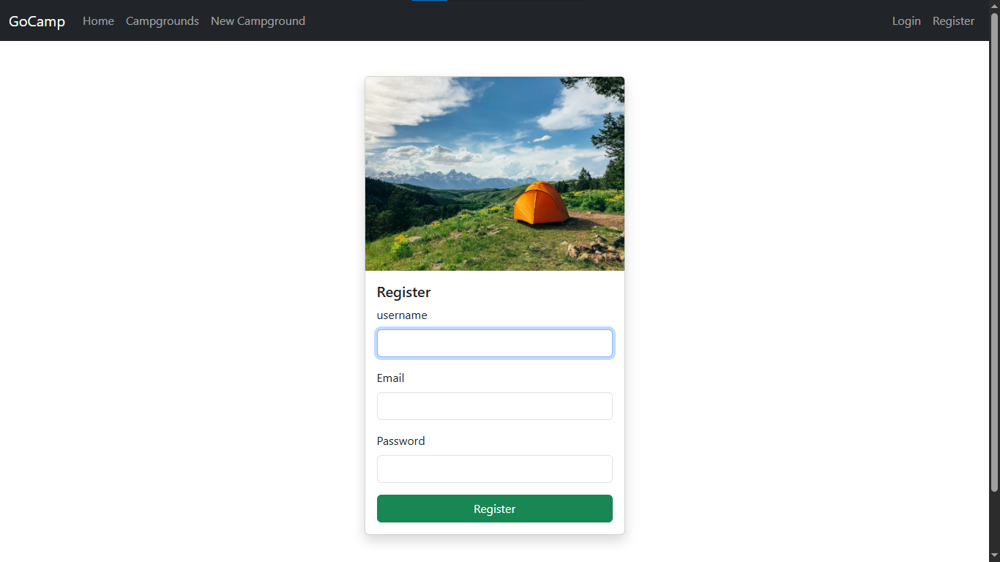
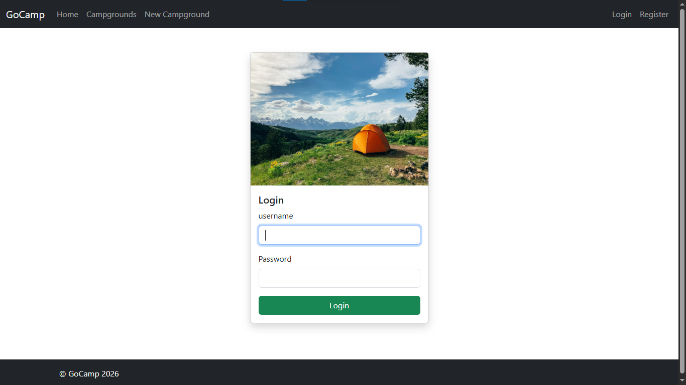
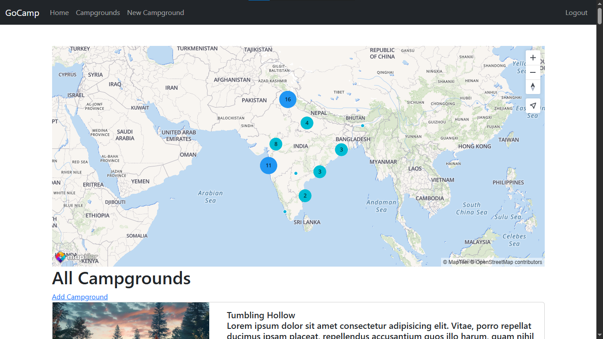
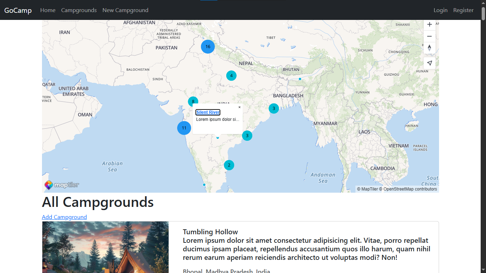
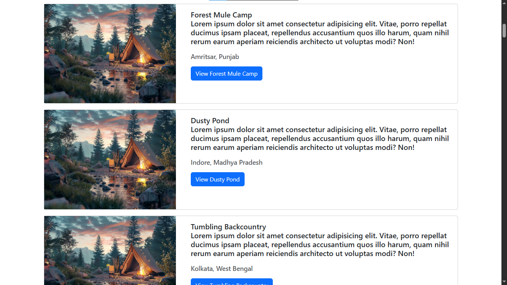
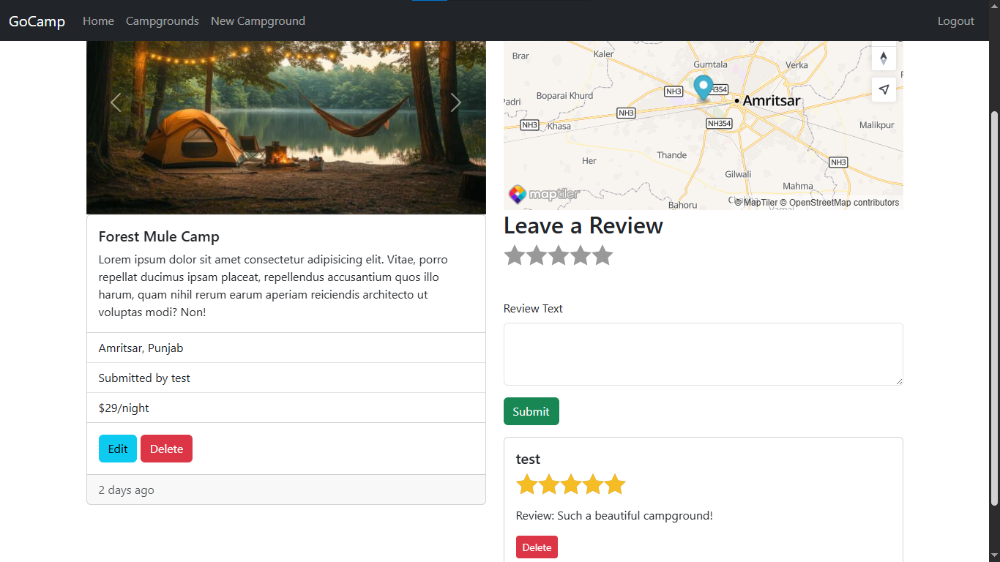
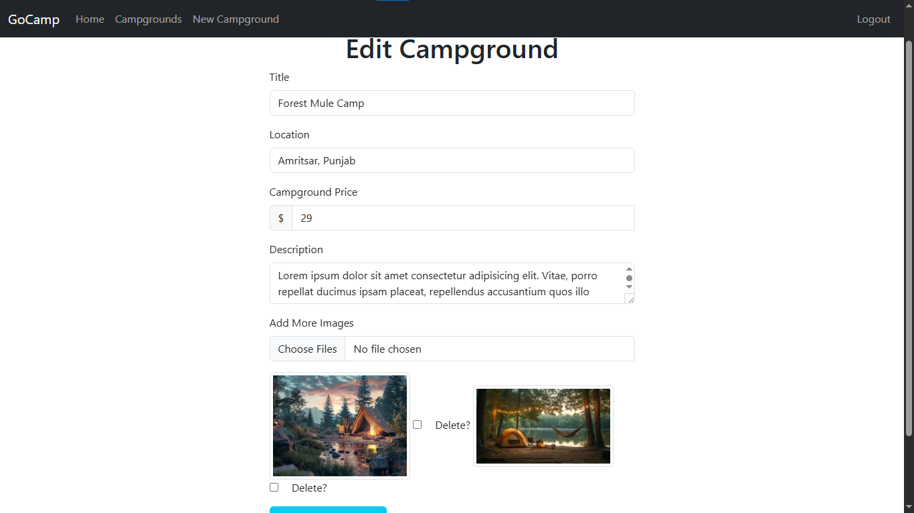
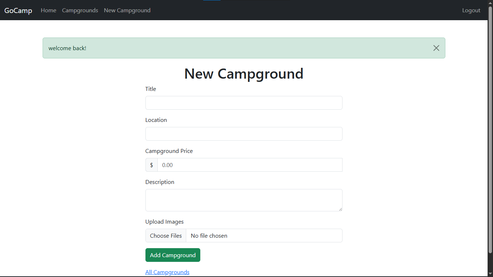

# GoCamp 🏕️

GoCamp is a full-stack campground listing and review web app. Users can browse campgrounds on an interactive map, sign up and log in, create and manage their own campground listings with photos, and leave ratings and reviews on other campgrounds.

Built with **Node.js, Express, MongoDB (Mongoose), and EJS**, with image uploads via **Cloudinary** and geocoding/maps via **MapTiler**.

🔗 **Live Demo:** [go-camp.vercel.app](https://go-camp.vercel.app/)

## Screenshots

| Home Page | Register |
|---|---|
|  |  |

| Login | Campgrounds (Map View) |
|---|---|
|  |  |

| Campgrounds (Map Marker) | Campgrounds (List View) |
|---|---|
|  |  |

| Show Campground | Edit Campground |
|---|---|
|  |  |

| New Campground |
|---|
|  |

## Features

- 🔐 User authentication (register, login, logout) with Passport.js
- 🏕️ Full CRUD for campgrounds (create, view, edit, delete)
- 🖼️ Image uploads stored on Cloudinary, with multiple images per campground
- 🗺️ Location geocoding and an interactive cluster map (MapTiler)
- ⭐ Reviews and star ratings on each campground, tied to the logged-in author
- 🔒 Authorization checks so only an author can edit/delete their own campgrounds and reviews
- 🛡️ Input sanitization (`express-mongo-sanitize`) and security headers (`helmet`)
- ✅ Server-side validation with Joi and HTML sanitization
- 🌱 Database seed script to populate sample campgrounds
- ☁️ Ready to deploy on Vercel

## Tech Stack

| Layer | Technology |
|---|---|
| Runtime | Node.js |
| Web framework | Express |
| Templating | EJS + `ejs-mate` |
| Database | MongoDB + Mongoose |
| Auth | Passport.js (`passport-local`, `passport-local-mongoose`) |
| File storage | Cloudinary + Multer |
| Maps/Geocoding | MapTiler Client |
| Sessions | `express-session` + `connect-mongo` |
| Validation | Joi, `sanitize-html` |
| Security | Helmet, `express-mongo-sanitize` |

## Project Structure

```
GoCamp/
├── cloudinary/          # Cloudinary config & storage engine
├── controllers/         # Route handler logic (campgrounds, reviews, users)
├── models/               # Mongoose schemas (Campground, Review, User)
├── public/                # Static assets (CSS, client-side JS)
├── routes/                # Express routers
├── seeds/                 # Database seeding scripts and sample data
├── utils/                 # Helpers (async wrapper, custom error class)
├── views/                 # EJS templates
├── app.js                 # App entry point
├── middleware.js          # Custom Express middleware
├── schemas.js              # Joi validation schemas
└── vercel.json              # Vercel deployment config
```

## Prerequisites

- [Node.js](https://nodejs.org/) (v18+ recommended)
- A [MongoDB](https://www.mongodb.com/) database (local instance or a MongoDB Atlas cluster)
- A [Cloudinary](https://cloudinary.com/) account (for image uploads)
- A [MapTiler](https://www.maptiler.com/) API key (for maps and geocoding)

## Getting Started

### 1. Clone the repository

```bash
git clone https://github.com/sundaram-s0706/GoCamp.git
cd GoCamp
```

### 2. Install dependencies

```bash
npm install
```

### 3. Configure environment variables

Create a `.env` file in the project root with the following variables:

```env
DB_URL=your_mongodb_connection_string
SECRET=your_session_secret
CLOUDINARY_CLOUD_NAME=your_cloudinary_cloud_name
CLOUDINARY_KEY=your_cloudinary_api_key
CLOUDINARY_SECRET=your_cloudinary_api_secret
MAPTILER_API_KEY=your_maptiler_api_key
PORT=3000
```

> If `DB_URL` isn't set, the app falls back to `mongodb://localhost:27017/go-camp-maptiler`.

### 4. (Optional) Seed the database

Populate the database with sample campgrounds:

```bash
node seeds/index.js
```

### 5. Run the app

```bash
node app.js
```

The app will be available at `http://localhost:3000` (or your configured `PORT`).

## Deployment

This project includes a `vercel.json` and is configured to deploy directly on [Vercel](https://vercel.com/). Make sure to add the same environment variables listed above to your Vercel project settings before deploying.

## License

ISC
